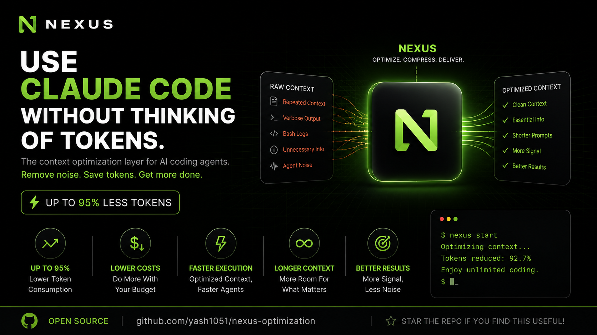

<picture>
  
</picture>

# Nexus — AI Context Optimization Engine

<p>
  <a href="https://github.com/yash1051/nexus-optimization"></a>
  <a href="LICENSE"></a>
  <a href="#"></a>
</p>

**Nexus** sits between your AI coding assistant and the shell — intercepting, filtering, and compressing command output so your AI gets exactly what it needs, not a firehose of noise.

> **60–90% fewer tokens. Zero quality loss. Entirely on-device.**

---

## ✨ At a Glance

```bash
# Before (raw shell output — ~2,000 tokens)
git status → 47 files changed, 1,284 insertions, 96 deletions...

# After (Nexus filtered — ~200 tokens)
nexus git status → 3 files: src/main.rs (+142/-89), README.md (+12/-7)
```

| Without Nexus | With Nexus |
|---|---|
| AI drowns in noise | AI gets signal |
| ~115K tokens/session | ~23K tokens/session |
| $0.58/session (Claude) | $0.12/session |

---

## 🚀 Quick Start

```bash
# 1. Install
git clone https://github.com/yash1051/nexus-optimization.git
cd nexus-optimization
cargo install --path .

# 2. Use it
nexus git status
nexus cargo test
nexus ls -la

# 3. Track savings
nexus gain
```

> **Already have Rust?** Just `cargo install --path .` — see full [Installation](#installation) below.

---

## 🧠 Why Nexus?

AI coding assistants are only as good as the context you give them. Every `git status`, `cargo test`, or `grep` dump costs tokens — and attention.

**Nexus bakes filtering directly into your workflow:**

| Command | Raw Tokens | Nexus Tokens | Savings |
|---|---|---|---|
| `git diff` | 2,000 | 250 | **87%** |
| `cargo test` | 5,000 | 500 | **90%** |
| `pytest` | 2,000 | 200 | **90%** |
| `docker ps` | 300 | 60 | **80%** |
| `grep -r` | 2,000 | 400 | **80%** |
| **Typical session** | **~115,000** | **~23,400** | **80%** |

12 filtering strategies power these savings — from stats extraction and error-only mode to smart grouping and tree compression.

---

## ⚙️ Installation

### Prerequisites

```bash
# Install Rust (if you don't have it)
curl --proto '=https' --tlsv1.2 -sSf https://sh.rustup.rs | sh
source "$HOME/.cargo/env"
```

### Build & Install

```bash
git clone https://github.com/yash1051/nexus-optimization.git
cd nexus-optimization
cargo install --path .
```

> First build takes ~1–2 minutes; subsequent builds are seconds.

### Verify

```bash
nexus --version       # → nexus 0.1.0
nexus --help
nexus git status      # inside any git repo
```

### Troubleshooting

| Problem | Fix |
|---|---|
| `command not found: cargo` | `source "$HOME/.cargo/env"` or restart terminal |
| `command not found: nexus` | `export PATH="$HOME/.cargo/bin:$PATH"` |
| Build fails | `rustup update stable` |

---

## 🎯 Usage

### File Operations

```bash
nexus ls .                     # Compact directory listing
nexus read src/main.rs         # Syntax-aware file preview
nexus grep "pattern" .         # Grouped match results
```

### Git

```bash
nexus git status               # Summary: "3 files, +142/-89"
nexus git diff                 # Collapsed diff stats
nexus git log -n 10            # One-line-per-commit
nexus git push                 # → "ok main"
```

### Testing & Linting

```bash
nexus cargo test               # Only failures + summary
nexus pytest                   # Failure-focused output
nexus go test                  # Aggregated pass/fail
nexus jest / vitest            # Minimal test report
nexus cargo clippy             # Grouped by lint rule
nexus ruff check               # Error summary
nexus golangci-lint run        # File-grouped output
```

### Cloud & Infrastructure

```bash
nexus docker ps                # Container list (compact)
nexus kubectl pods             # Pod status summary
nexus aws ec2 describe-instances
```

---

## 🔌 Hook Integration (One-Time Setup)

For **zero-friction** use, install the hook so every command is auto-routed through Nexus:

```bash
nexus init -g                  # Global hook for Claude Code
```

After that, the AI's normal shell commands get filtered transparently — no need to type `nexus` yourself.

Hooks available for: **Claude Code, Cursor, Gemini CLI, Copilot, Windsurf, Cline, Codex, OpenCode, Pi, Hermes, Kilocode, Antigravity.**

```bash
nexus init --help              # See all supported tools
```

---

## 📊 Track Your Savings

Every filtered command is logged to a local SQLite database.

```bash
nexus gain                     # Dashboard overview
nexus gain --history           # Recent commands with savings
nexus gain --graph             # 30-day ASCII chart
nexus gain --daily             # Day-by-day breakdown
nexus gain --weekly            # Week-by-week
nexus gain --top 10            # Most-used commands
nexus gain --since 7           # Last 7 days
nexus gain --scope project     # Current project only
nexus gain --format json       # Machine-readable
```

**Sample output:**
```
Nexus Token Savings (Global Scope)
════════════════════════════════════════════════════════════

Total commands:    127
Input tokens:      48,302
Output tokens:     9,142
Tokens saved:      39,160 (81.1%)
Efficiency meter: ████████████████████░░░░ 81.1%
```

> **Pro tip:** Run `watch -n 2 'nexus gain | head -8'` in a side terminal to watch savings tick up in real time.

---

## 🏗️ How It Works

12 filtering strategies applied per command:

| Strategy | What It Does | Reduction |
|---|---|---|
| **Stats Extraction** | `5000 diff lines` → `"+142/-89"` | 90–99% |
| **Error Only** | Mixed output → stderr only | 60–80% |
| **Grouping** | Lint errors grouped by rule | 80–90% |
| **Deduplication** | `[ERROR] (×5)` | 70–85% |
| **Structure Only** | JSON keys + types, no values | 80–95% |
| **Code Filtering** | Strip comments/bodies | 20–90% |
| **Failure Focus** | 100 tests → only failures | 94–99% |
| **Tree Compression** | Flat list → tree with counts | 50–70% |
| **Progress Filtering** | ANSI bars → final result | 85–95% |
| **JSON/Text Dual** | Use `--format json` when available | 80%+ |
| **State Machine** | Pytest → counts + failures | 90%+ |
| **NDJSON Streaming** | `go test` → aggregated summary | 90%+ |

---

## ⚡ Performance

| Metric | Value |
|---|---|
| Binary size | ~4 MB (stripped) |
| Cold startup | <10 ms |
| Memory usage | <5 MB typical |
| Filter overhead | 2–15 ms per command |

---

## 🔧 Configuration

```toml
# ~/.config/nexus/config.toml (macOS: ~/Library/Application Support/nexus/config.toml)
[hooks]
exclude_commands = ["curl", "playwright"]

[tee]
enabled = true
mode = "failures"       # "failures", "always", or "never"
```

---

## 🗺️ Architecture

```
src/
├── main.rs        # CLI router (Clap)
├── cmds/          # 42 command filter modules
├── core/          # Shared infra: config, tracking, tee, TOML engine
├── filters/       # 60+ declarative TOML filter recipes
├── hooks/         # Hook installer for 10+ AI tools
├── analytics/     # Token savings & reporting
├── discover/      # Optimization opportunity scanning
└── learn/         # CLI correction detection
```

---

## 🤝 Contributing

PRs welcome! New filters are easy to add — check `src/cmds/README.md` for the checklist.

---

## 📄 License

Apache License 2.0 — see [LICENSE](LICENSE) and [NOTICE](NOTICE).
